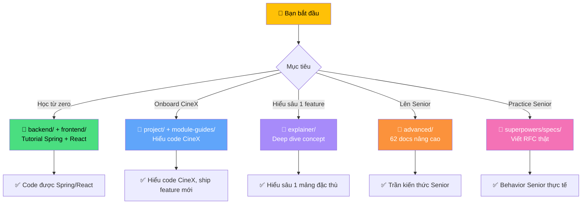
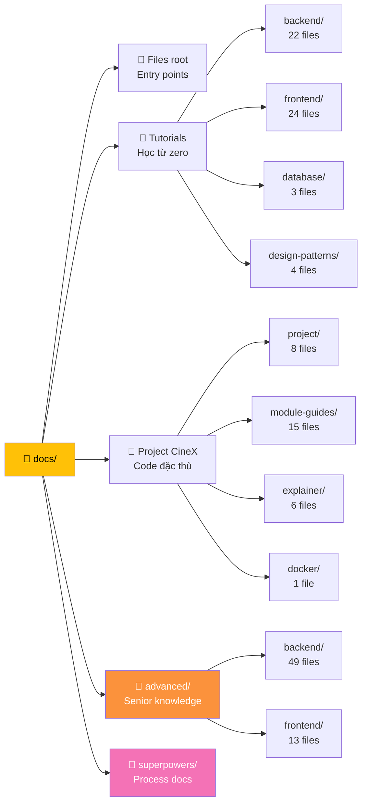
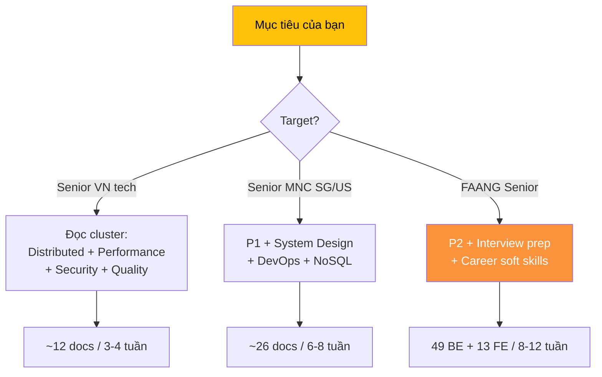
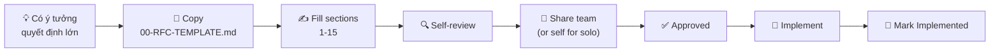
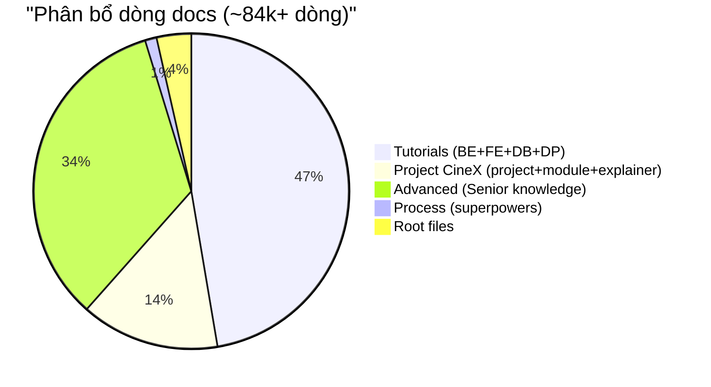
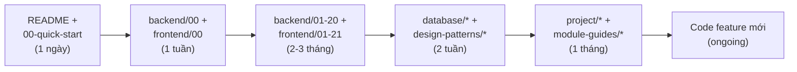
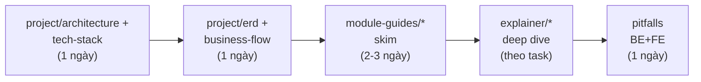
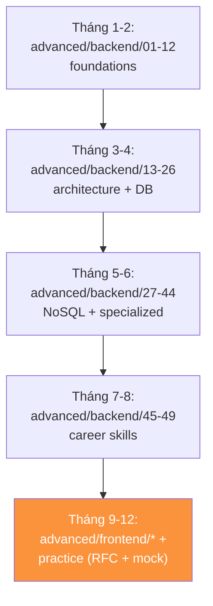
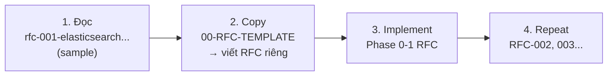

# 🗺️ CineX Documentation Map — Sơ đồ tổng quan toàn bộ docs

> Toàn bộ `/docs/` của project CineX (~84k dòng) chia 6 nhóm. File này là **bản đồ trực quan** giúp bạn biết đọc gì khi nào, theo thứ tự nào.
>
> **Mẹo**: GitHub render Mermaid diagrams native. Mở file này trên https://github.com/VuTuongAn/cinex/blob/main/docs/00-documentation-map.md để xem diagram đẹp nhất.

---

## 🎯 Bạn đang ở mức nào? Đi đâu trước?

---

## 🗂️ Cấu trúc `/docs/` (tổng quát)

---

## 1️⃣ Files root — Entry points

Đọc đầu tiên khi mới vào repo.

| File | Khi nào đọc |
|------|------------|
| [`README.md`](README.md) | Lần đầu vào repo |
| [`00-quick-start.md`](00-quick-start.md) | Setup local nhanh |
| [`00-tech-stack.md`](00-tech-stack.md) | Biết CineX dùng tech nào |
| [`00-architecture-overview.md`](00-architecture-overview.md) | Hiểu kiến trúc tổng quan |
| [`glossary.md`](glossary.md) | Tra thuật ngữ (CDN, JWT, ACID...) |
| [`common-mistakes.md`](common-mistakes.md) | Tránh lỗi phổ biến |
| [`test-cases.md`](test-cases.md) | Test plan |
| [`features-completed.md`](features-completed.md) | Trạng thái features |
| [`setup-fresh-db.md`](setup-fresh-db.md) | Setup DB từ đầu |
| [`multi-tenant-explained.md`](multi-tenant-explained.md) | Multi-tenant pattern |
| [`00-audit-knowledge-gaps.md`](00-audit-knowledge-gaps.md) | Báo cáo audit 75 files |

---

## 2️⃣ Tutorials — Học từ zero (dành cho sinh viên)

> Khoảng **~32k dòng**, dạy Spring Boot + React **từ đầu**. Nếu bạn đã biết, lướt qua.

### 📁 `backend/` (22 files, ~16k dòng) — Spring Boot từ zero

### 📁 `frontend/` (24 files, ~16k dòng) — React/TS từ zero

### 📁 `database/` (3 files) — Database fundamentals

- [`01-database-techniques.md`](database/01-database-techniques.md) — Normalization, indexing
- [`02-liquibase-guide.md`](database/02-liquibase-guide.md) — Migration
- [`03-id-tracker.md`](database/03-id-tracker.md) — IdTracker pattern CineX

### 📁 `design-patterns/` (4 files) — GoF + SOLID

- [`01-creational-patterns.md`](design-patterns/01-creational-patterns.md) — Factory, Builder, Singleton
- [`02-structural-patterns.md`](design-patterns/02-structural-patterns.md) — Adapter, Decorator, Facade
- [`03-behavioral-patterns.md`](design-patterns/03-behavioral-patterns.md) — Strategy, Observer, State
- [`04-solid-principles.md`](design-patterns/04-solid-principles.md) — SOLID đầy đủ

---

## 3️⃣ Project CineX — Đặc thù dự án

### 📁 `project/` (8 files) — Setup, deploy, architecture CineX

| File | Tác dụng |
|------|----------|
| [`setup.md`](project/setup.md) | Setup project chi tiết |
| [`architecture.md`](project/architecture.md) | Kiến trúc CineX |
| [`business-flow.md`](project/business-flow.md) | Luồng nghiệp vụ |
| [`tech-stack-explained.md`](project/tech-stack-explained.md) | Tại sao chọn tech này |
| [`erd.md`](project/erd.md) + [`erd.drawio`](project/erd.drawio) | ERD database |
| [`deploy-guide.md`](project/deploy-guide.md) | Deploy production |
| [`git-guide.md`](project/git-guide.md) | Git workflow team |

### 📁 `module-guides/` (15 files) — Mỗi module CineX 1 file

```mermaid
flowchart TB
    Core["📁 module-guides/<br/>15 files"]
    Core --> Infra["01-common-infra"]
    Core --> Auth["02-auth"]
    Core --> User["03-user"]
    Core --> Filter["04-filter-spec"]
    Core --> Movie["05-movie"]
    Core --> Room["06-room"]
    Core --> Seat["07-seat"]
    Core --> Show["08-showtime"]
    Core --> Book["09-booking"]
    Core --> Pay["10-payment"]
    Core --> Review["11-review"]
    Core --> Snack["12-snack"]
    Core --> Noti["13-notification"]
    Core --> Fav["14-favorite"]
    Core --> Stats["15-statistics"]
    Core --> Theater["15-theater"]
    Core --> Pricing["16-pricing"]
    Core --> Loyalty["17-loyalty"]
    Core --> Combo["18-combo"]
    Core --> Voucher["19-voucher"]

    style Core fill:#ffc107,color:#000
```

**Quy tắc đọc**: Khi cần sửa module X → đọc `module-guides/0X-X-explained.md` TRƯỚC khi code.

### 📁 `explainer/` (6 files) — Deep dive 1 concept đặc thù CineX

| File | Topic |
|------|-------|
| [`age-rating.md`](explainer/age-rating.md) | TT 25/2024 phân loại tuổi P/K/T13/T16/T18 |
| [`caching-strategy.md`](explainer/caching-strategy.md) | Cache pattern CineX |
| [`drag-paint-pattern.md`](explainer/drag-paint-pattern.md) | Seat editor drag-paint UX |
| [`movie-run.md`](explainer/movie-run.md) | MovieRun lifecycle (đợt chiếu) |
| [`pricing-engine.md`](explainer/pricing-engine.md) | Pricing rule engine |
| [`security-hardening.md`](explainer/security-hardening.md) | Security implementation |

### 📁 `docker/` (1 file) — Docker compose CineX

- [`01-docker-guide.md`](docker/01-docker-guide.md) — Container setup

---

## 4️⃣ `advanced/` — Senior knowledge (62 files, ~28.5k dòng)

> ⚠️ **KIẾN THỨC NÂNG CAO** không apply trực tiếp vào CineX. Dùng để **học LÊN Senior**. Đọc theo target.

### 🎯 Roadmap theo TARGET (đề xuất thứ tự)

### Backend `advanced/backend/` (49 files) — 13 categories

#### 🌐 Distributed Systems & Data (7 docs)
| # | File | Topic |
|---|------|-------|
| 01 | [Kafka deep](advanced/backend/01-kafka-deep.md) | Consumer group rebalancing |
| 02 | [CDC Debezium](advanced/backend/02-cdc-debezium.md) | Outbox pattern |
| 03 | [Saga](advanced/backend/03-saga-distributed-tx.md) | Distributed transaction |
| 04 | [Idempotency](advanced/backend/04-idempotency.md) | Stripe-style key pattern |
| 05 | [CQRS + Event Sourcing](advanced/backend/05-cqrs-event-sourcing.md) | Read/write separation |
| 17 | [Elasticsearch + Lucene](advanced/backend/17-elasticsearch-lucene.md) | Inverted index, BM25 |
| 24 | [gRPC + Protobuf](advanced/backend/24-grpc-protobuf.md) | HTTP/2 streaming |

#### 🏛️ Architecture (5 docs)
| # | File | Topic |
|---|------|-------|
| 06 | [DDD + Hexagonal](advanced/backend/06-ddd-hexagonal.md) | Bounded context |
| 13 | [System Design fundamentals](advanced/backend/13-system-design-fundamentals.md) | CAP, Raft, consistent hashing |
| 18 | [System Design interview cheatsheet](advanced/backend/18-system-design-interview-cheatsheet.md) | 5 designs (Bitly, Twitter, Uber, Netflix, WhatsApp) |
| 25 | [Multi-tenancy patterns](advanced/backend/25-multi-tenancy-patterns.md) | 3 isolation strategies |
| 26 | [AI/LLM integration](advanced/backend/26-ai-llm-integration.md) | RAG + Vector DB |

#### ⚡ Performance & Ops (7 docs)
| # | File | Topic |
|---|------|-------|
| 07 | [Caching strategies](advanced/backend/07-caching-strategies.md) | Stampede, hot key |
| 08 | [Rate limiting](advanced/backend/08-rate-limiting.md) | Token bucket, sliding window |
| 09 | [JVM tuning](advanced/backend/09-jvm-tuning.md) | GC, OOM debug |
| 10 | [HikariCP](advanced/backend/10-connection-pool.md) | Pool sizing |
| 14 | [Database internals](advanced/backend/14-database-internals.md) | B-tree vs LSM, MVCC |
| 15 | [Observability + SLO](advanced/backend/15-observability-slo.md) | OpenTelemetry, Prometheus |
| 16 | [Resilience patterns](advanced/backend/16-resilience-patterns.md) | Circuit Breaker, Bulkhead |

#### 🚀 DevOps (2 docs)
| # | File | Topic |
|---|------|-------|
| 19 | [Kubernetes deep](advanced/backend/19-kubernetes-deep.md) | Pods, Operators, GitOps |
| 23 | [CI/CD + GitOps](advanced/backend/23-cicd-gitops.md) | Blue-green, Canary, Feature flags |

#### 🔒 Security (1 doc)
| # | File | Topic |
|---|------|-------|
| 20 | [Security deep](advanced/backend/20-security-deep.md) | OAuth2/JWT/OWASP/mTLS |

#### ✅ Quality (2 docs)
| # | File | Topic |
|---|------|-------|
| 21 | [Testing strategy](advanced/backend/21-testing-strategy.md) | Test pyramid, contract, mutation |
| 22 | [Zero-downtime migration](advanced/backend/22-zero-downtime-migration.md) | Expand-contract pattern |

#### ⚙️ Concurrency & API (2 docs)
| # | File | Topic |
|---|------|-------|
| 11 | [Async + CompletableFuture](advanced/backend/11-async-completablefuture.md) | Virtual Threads |
| 12 | [API versioning](advanced/backend/12-api-versioning.md) | Deprecation strategy |

#### 💾 NoSQL (6 docs)
| # | File | Topic |
|---|------|-------|
| 27 | [MongoDB deep](advanced/backend/27-mongodb-deep.md) | Document DB, aggregation |
| 28 | [Cassandra + DynamoDB](advanced/backend/28-cassandra-dynamodb.md) | Wide-column |
| 29 | [Redis as primary DB](advanced/backend/29-redis-as-primary-db.md) | 9 data types |
| 30 | [Graph DB Neo4j](advanced/backend/30-graph-db-neo4j.md) | Cypher, PageRank |
| 31 | [Time-Series DB](advanced/backend/31-time-series-db.md) | Prometheus, InfluxDB, TimescaleDB |
| 32 | [NoSQL vs SQL decision](advanced/backend/32-nosql-vs-sql-decision.md) | Framework chọn DB |

#### 🎯 Interview prep (2 docs)
| # | File | Topic |
|---|------|-------|
| 33 | [LeetCode 75 patterns](advanced/backend/33-leetcode-patterns.md) | 15 patterns + 75 problems |
| 34 | [Behavioral STAR](advanced/backend/34-behavioral-interview-star.md) | Story templates, Amazon LP |

#### 🏗️ Engineering Excellence (3 docs)
| # | File | Topic |
|---|------|-------|
| 35 | [Software Craftsmanship](advanced/backend/35-software-craftsmanship.md) | Clean Code, refactoring |
| 36 | [Network deep](advanced/backend/36-network-deep.md) | TCP/IP, HTTP/2/3, TLS, DNS |
| 37 | [Linux internals](advanced/backend/37-linux-internals.md) | Process, epoll, eBPF |

#### ☁️ Production Cloud (3 docs)
| # | File | Topic |
|---|------|-------|
| 38 | [AWS Cloud deep](advanced/backend/38-cloud-aws-deep.md) | IAM, VPC, S3, Lambda |
| 39 | [Disaster Recovery](advanced/backend/39-disaster-recovery.md) | RPO/RTO, multi-region |
| 40 | [Cost optimization](advanced/backend/40-cost-optimization.md) | FinOps |

#### 🔧 Specialized (4 docs)
| # | File | Topic |
|---|------|-------|
| 41 | [Compliance GDPR/PCI](advanced/backend/41-compliance-gdpr-pci.md) | Right to Forgotten, Tokenization |
| 42 | [Workflow Temporal](advanced/backend/42-workflow-engines-temporal.md) | Durable execution |
| 43 | [Data Engineering](advanced/backend/43-data-engineering-basics.md) | ETL/ELT, Spark, Airflow, dbt |
| 44 | [MLOps + LLM Serving](advanced/backend/44-mlops-llm-serving.md) | Feature Store, vLLM |

#### 👥 Career & Soft Skills (5 docs)
| # | File | Topic |
|---|------|-------|
| 45 | [Technical Writing](advanced/backend/45-technical-writing-rfc-adr.md) | RFC, ADR, Design Doc, Postmortem |
| 46 | [Code Review Excellence](advanced/backend/46-code-review-excellence.md) | Reviewing + Receiving |
| 47 | [Mentorship Growth](advanced/backend/47-mentorship-growth.md) | 1-on-1s, SBI feedback |
| 48 | [Hiring as Interviewer](advanced/backend/48-hiring-as-interviewer.md) | Rubric, STAR drill |
| 49 | [Tech Debt Management](advanced/backend/49-tech-debt-management.md) | Quadrant analysis |

### Frontend `advanced/frontend/` (13 files)

| # | File | Topic |
|---|------|-------|
| 01 | [Error Boundaries deep](advanced/frontend/01-error-boundaries-deep.md) | Hierarchy, async workaround |
| 02 | [Suspense + Concurrent](advanced/frontend/02-suspense-concurrent.md) | startTransition, RSC |
| 03 | [A11y](advanced/frontend/03-accessibility-a11y.md) | ARIA, WCAG, focus trap |
| 04 | [Custom Hooks](advanced/frontend/04-custom-hooks-patterns.md) | useDebounce, useEvent |
| 05 | [SSR / CSR / RSC](advanced/frontend/05-ssr-csr-rsc.md) | Hydration |
| 06 | [PWA + Service Worker](advanced/frontend/06-pwa-service-worker.md) | Offline, push |
| 07 | [Web Vitals + RUM](advanced/frontend/07-web-vitals-rum.md) | LCP/INP/CLS |
| 08 | [Bundle optimization](advanced/frontend/08-bundle-optimization.md) | Tree shaking |
| 09 | [TypeScript advanced](advanced/frontend/09-typescript-advanced.md) | Conditional/Mapped/Template literal |
| 10 | [State variants](advanced/frontend/10-state-management-variants.md) | Redux, Jotai, MobX, XState |
| 11 | [GraphQL Apollo](advanced/frontend/11-graphql-apollo-deep.md) | Normalized cache |
| 12 | [CSS architecture](advanced/frontend/12-css-architecture.md) | BEM, Tailwind, tokens |
| 13 | [Build tools internals](advanced/frontend/13-build-tools-internals.md) | Vite, esbuild, SWC |

---

## 5️⃣ `superpowers/specs/` — Process docs

> Tài liệu **PLANNING** trước khi làm việc lớn. KHÔNG phải kiến thức.

### Files hiện có

| File | Type | Tác dụng |
|------|------|----------|
| [`00-RFC-TEMPLATE.md`](superpowers/specs/00-RFC-TEMPLATE.md) | Template | Copy mỗi lần viết RFC mới |
| [`2026-06-08-docs-knowledge-audit-design.md`](superpowers/specs/2026-06-08-docs-knowledge-audit-design.md) | Spec | Audit 75 docs phát hiện gap |
| [`2026-06-12-rfc-001-elasticsearch-movie-search.md`](superpowers/specs/2026-06-12-rfc-001-elasticsearch-movie-search.md) | RFC | Sample RFC migrate movie search → ES |

### Cách dùng

---

## 📊 Quy mô tổng quát

| Nhóm | Files | Dòng | Target |
|------|-------|------|--------|
| **Tutorials** | 53 | ~40k | Sinh viên học |
| **Project CineX** | 30 | ~12k | Onboard project |
| **Advanced** | 62 | ~28.5k | Lên Senior |
| **Process** | 3 | ~1k | Practice RFC |
| **Root files** | 14 | ~3k | Entry points |
| **TỔNG** | **162** | **~84.5k** | |

---

## 🎯 Reading paths đề xuất

### Path A — Sinh viên mới (3-6 tháng)

### Path B — Dev 1-2 năm KN, onboard CineX (2 tuần)

### Path C — Dev 2+ năm, lên Senior (6-12 tháng)

### Path D — Practice Senior moves

---

## 🔗 Quick links

- 📂 **GitHub repo**: [VuTuongAn/cinex](https://github.com/VuTuongAn/cinex)
- 📂 **Mirror cinex-team**: [VuTuongAn/cinex-team](https://github.com/VuTuongAn/cinex-team)
- 📍 **Local path**: `/Users/vutuongan/cinex/docs/`

## ⚠️ Lưu ý quan trọng

> **`/docs/advanced/*` chỉ push lên `cinex` repo, KHÔNG push lên `cinex-team`** (personal Senior learning material, không thuộc project work). Map file này (`00-documentation-map.md`) tham chiếu `/docs/advanced/*` nên cũng chỉ tồn tại trên `cinex`.

> Mỗi lần touch code: đọc memory-bank + module-guide tương ứng TRƯỚC.

---

## 🔄 Cách update file này

Khi thêm/xoá docs lớn:

1. Update bảng tương ứng (root / tutorials / advanced / ...).
2. Update tổng số files + dòng ở Section "Quy mô tổng quát".
3. Update flow chart nếu thay đổi reading order.
4. Commit message: `docs(map): cập nhật sau khi thêm/xoá X`.

Hoặc gọi Claude: "Update lại documentation map sau khi thêm/xoá X" — sẽ tự điều chỉnh.

---

*Tạo bằng Claude Opus 4.7 ngày 2026-06-12. Render Mermaid native trên GitHub.*
